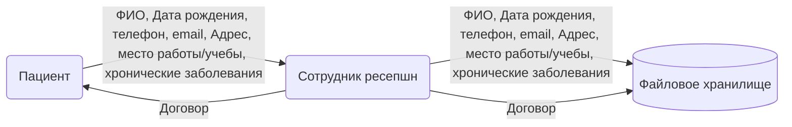
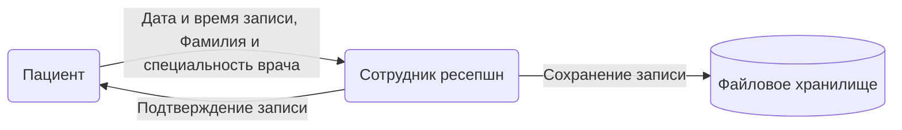
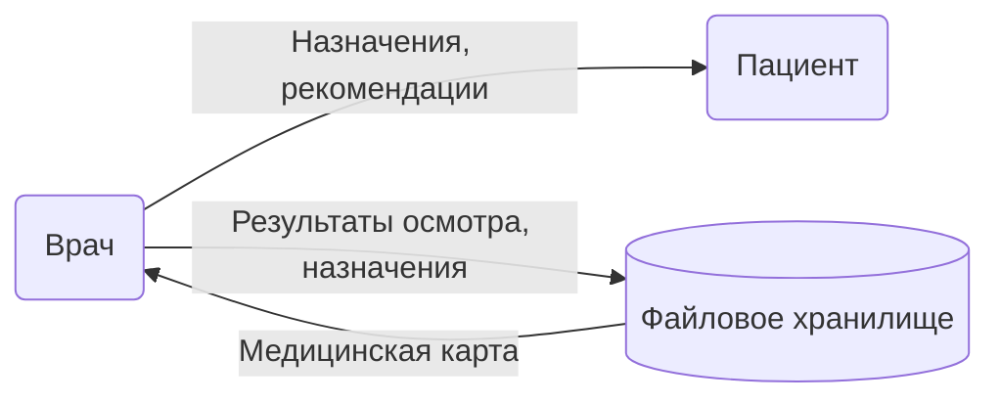
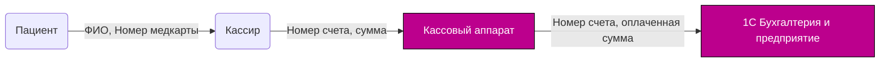
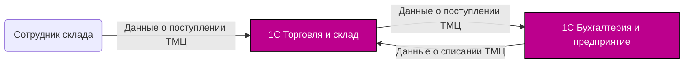

## Оформление договора

```mermaid
graph LR
    Customer(Пациент) 
    Employe(Сотрудник ресепшн)
    DB[(Файловое хранилище)]
    Customer --> |ФИО, Дата рождения, телефон, email, Адрес, место работы/учебы, хронические заболевания| Employe
    Employe --> |ФИО, Дата рождения, телефон, email, Адрес, место работы/учебы, хронические заболевания| DB
    Employe --> |Договор| Customer
    Employe --> |Договор| DB
```

---

## Запись ко врачу

```mermaid
graph LR
    Customer(Пациент)
    Employe(Сотрудник ресепшн)
    DB[(Файловое хранилище)]
    Customer --> |Дата и время записи, Фамилия и специальность врача| Employe
    Employe --> |Подтверждение записи| Customer
    Employe --> |Сохранение записи| DB
```

## Прием в клинике

```mermaid
graph LR
    Customer(Пациент)
    Employe(Врач)
    DB[(Файловое хранилище)]

    Employe --> |Назначения, рекомендации| Customer
    Employe --> |Результаты осмотра, назначения| DB 
    DB --> |Медицинская карта| Employe
    
```

## Оплата приема

```mermaid
graph LR
    classDef highlight fill:#BC008D,stroke:#000,color:#FFF

    Customer(Пациент)
    Employe(Кассир)
    System[Кассовый аппарат]
    System1[1C Бухгалтерия и предприятие]

    Customer --> |ФИО, Номер медкарты| Employe
    Employe --> |Номер счета, сумма| System:::highlight
    System:::highlight --> |Номер счета, оплаченная сумма| System1:::highlight
```

## Работа с ТМЦ

```mermaid
graph LR
    
    Employe(Сотрудник склада)
    System[1C Бухгалтерия и предприятие]
    System1[1C Торговля и склад]
    classDef highlight fill:#BC008D,stroke:#000,color:#FFF

    Employe --> |Данные о поступлении ТМЦ|System1
    System1:::highlight --> |Данные о поступлении ТМЦ| System:::highlight
    System:::highlight --> |Данные о списании ТМЦ| System1:::highlight
```
