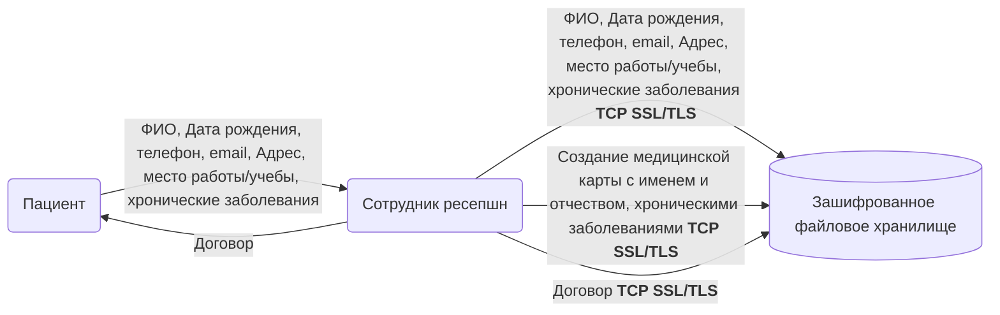
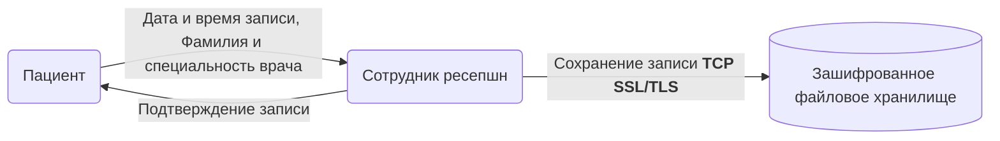
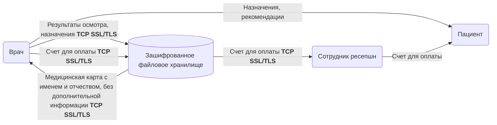
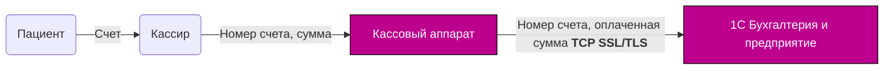
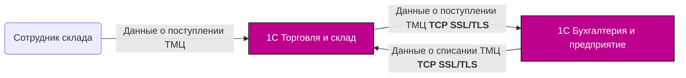

## Аворизация и ролевой доступ
1. На файловом сервере настраиваются группы пользователей: Ресепшн, Врач, бэк-офис. Для каждой из групп настраивается доступ в соответствующие папки с файлами:
    - Ресепшн - папка с договорами и сканами личных документов
    - Врач - папка с мед. картами и снимками
    - бэк-офис - папка с платежными ведомостями и другими документами
1. На компьютерах врачей и сотрудников ресепшн настраивается screensaver, срабатывающий при 30с неактивности пользователя
1. Передача данных между компьютерами пользователей и сервером шифруется через SSL/TLS

## Оформление договора

---

## Запись ко врачу

## Прием в клинике

## Оплата приема

## Работа с ТМЦ

